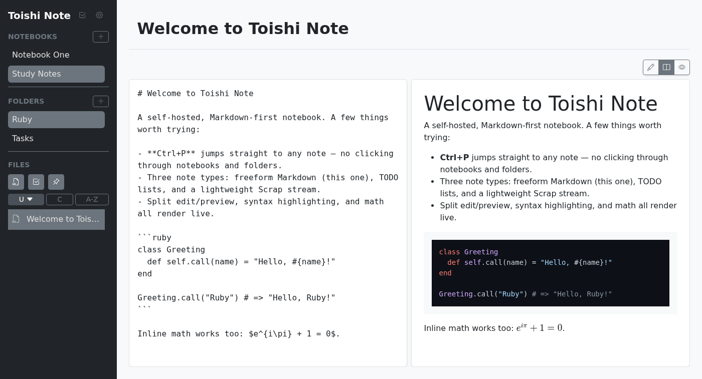
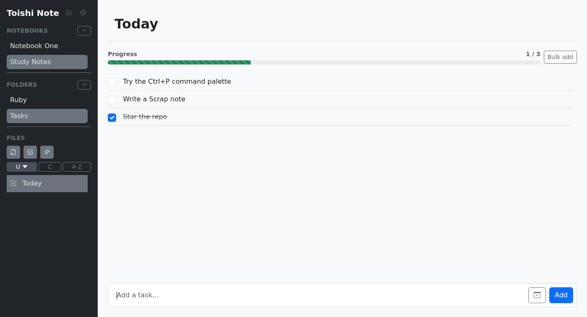

# Toishi Note

Rails 8 + Hotwire で作られた、セルフホスト型・Markdown ファーストのノートアプリです。ノートブックとフォルダで整理し、用途に合わせてノートの種類を選べます — 自由記述の Markdown（分割編集/プレビュー、シンタックスハイライト、数式対応）、TODO リスト、断片を素早く書き留める軽量な Scrap ストリームの3種類です。

このプロジェクトはまだリリース前で、開発が続いています。今後の方向性は [docs/product/roadmap.md](docs/product/roadmap.md)（英語）を参照してください。[English README](README.md)



## こんな人向け

Obsidian や Notion で勉強用・仕事用のノートを取っていて、それを自分が管理できるサーバーに置きたいと思っている人向けです。

| | Obsidian | Notion | Toishi Note |
|---|---|---|---|
| マルチデバイス対応 | 有料の Sync、または自分で git/Syncthing を設定 | 対応 | **サーバーなのでそもそも対応** |
| データが自分の手元にある | Yes | No | **Yes** |
| チームメンバー1人あたりのコスト | 座席課金 | 座席課金 | **データベースの数行分** |
| いじれる | TypeScript プラグイン API | 不可 | **Rails アプリなので PR を送れる** |

すでに何かをセルフホストしていて、これからも続けるつもりがないなら、今のところこのアプリは向いていないかもしれません — ホスト版は存在しません。すでにセルフホストしているなら、下の `docker compose up` で数分で動かせます。



## セルフホスト・クイックスタート（Docker Compose）

```sh
git clone https://github.com/hrtmys/toishi-note.git
cd toishi-note
cp .env.example .env
bin/rails secret               # 自分専用の署名キーを生成する — 詳細は docs/engineering/deployment.md
# .env を編集: 生成された値を SECRET_KEY_BASE に、APP_HOST に自分のドメインを設定
docker compose up -d
```

`http://127.0.0.1:3000`（またはリバースプロキシを立てた先のアドレス）にアクセスし、初回セットアップ画面を完了してください。必要な環境変数やリバースプロキシの構成を含む詳しいガイドは [docs/engineering/deployment.md](docs/engineering/deployment.md)（英語）に、データのバックアップ手順（実際に検証済み、書いただけではない）は [docs/engineering/backup.md](docs/engineering/backup.md)（英語）にあります。

## 認証

新規インストール後の初回アクセスでは、**「自分だけ」か「チーム」か**を選ぶ一度きりのセットアップ画面が表示されます。

- **自分だけ**：ノートを取るアカウントを1つだけ作成します。それだけです — チーム管理 UI は一切表示されません。
- **チーム**：**それ自体はノートを取らない管理者アカウント**を作成します。管理者の仕事は、ノートを取るアカウントを招待すること、そしてアクセス権を失うべきアカウントを削除すること（メンバーごとの「削除」ボタン。管理者は自分自身をこの方法では削除できません）だけです。管理者はログイン名（メールアドレス、または後述するように単なるユーザー名でも可）だけでメンバーを招待します。返ってくるのは（パスワードではなく）一度きりのリンクで、チャットなどいつもの方法で本人に渡せます。招待されたメンバーはそのリンク経由で自分のパスワードを設定します。ロックアウトされたメンバーを救済する際も同じ仕組みで新しいリンクを発行します。管理者はこのフローのどの時点でも、他人のパスワードを選んだり知ったりすることは一切ありません。招待メールの送信もなく、メール配信が動いている必要もありません。
- **各アカウントのノートブックは、そのアカウント専用でプライベートです — 共有機能や権限モデルは一切ありません。** 「チーム」は、複数人で1つのデプロイを運用しつつ、それぞれが自分専用のスペースを持つためのものであり、チームで共有するワークスペースではありません（エディタには2人が同じノートを同時に編集した場合の競合処理がなく、アカウント間で何かが共有されることは設計上ありません）。メンバーを削除するとそのメンバーのノートブックも削除されます。確認画面で事前にその旨が表示されます。
- 「自分だけ」で始めて、後からもう1アカウント追加したくなった場合は、コンソールからの1行のプロモーション操作で行います（[SECURITY.md](SECURITY.md) 参照）。アプリ内のトグルではありません — 「自分だけ」利用者が絶対に使わないボタンを見せないための意図的な設計です。

いずれの場合も、サインイン後は:

- ログイン名（メールアドレスまたはユーザー名 — 1人が持つ会社のメールアドレスは1つで、それは自分自身のノート用アカウントですでに使われていることが多いため、管理者用ログインは必ずしもメールアドレスである必要はありません）とパスワードでサインインします。パスキーと OIDC は計画中です（[roadmap.md](docs/product/roadmap.md) の "Deferred, but not dropped" 参照）が、まだ実装されていません。パスワードを忘れた場合は [SECURITY.md](SECURITY.md) を参照してください — 組み込みの「パスワードを忘れた場合」のメールフローは本番環境で SMTP の設定が必要です。コンソールからのリセットはどんな環境でも設定不要で使えます。
- **信頼できるリバースプロキシの背後で運用する場合**（Cloudflare Access、Tailscale Serve、oauth2-proxy など）: `TRUSTED_HEADER_AUTH_HEADER` に、プロキシが認証済みユーザーのメールアドレスをセットするヘッダー名（例: `Cf-Access-Authenticated-User-Email`）を設定すると、そこから自動的にアカウントが作成・サインインされます — ログイン画面は一切表示されません。プロキシが実際にそのヘッダーを外部からのリクエストから取り除き、自身でセットするよう構成されている場合にのみ有効にしてください。そうでなければ、誰でも任意の人物を名乗れてしまいます。この方法で自動作成されるアカウントは常に一般（非管理者）アカウントです — パスワードと併用する場合やチームメンバーシップ・管理者アカウントとの関係については [SECURITY.md](SECURITY.md) を参照してください。

開発環境では、送信されるメール（パスワードリセットなど）はどこにも実際には届きません。代わりに `/letter_opener` で確認できます。

## コントリビューター向けクイックスタート（devcontainer）

開発環境を最速で整える方法は、同梱の [devcontainer](.devcontainer/devcontainer.json) を使うことです — Ruby、Node、このアプリに必要なシステムパッケージが一通りセットアップされます（内容と理由は [docs/engineering/dev-environment.md](docs/engineering/dev-environment.md) 参照）。

1. このリポジトリを VS Code（または [Dev Containers](https://containers.dev/) 対応の任意のエディタ）で開き、コンテナ内で再度開く。
2. `bin/setup` で依存関係のインストールとデータベースの準備。
3. `bin/dev` でアプリを起動し、`http://localhost:3000` にアクセス。

### 手動セットアップ

Ruby（[.ruby-version](.ruby-version) 参照）、Node.js、[docs/engineering/dev-environment.md](docs/engineering/dev-environment.md) に記載のシステムライブラリ（`libvips`、システムテストを実行する場合は Chromium ベースのブラウザ）が必要です。

```sh
bundle install
bin/rails db:prepare
bin/dev
```

## テストの実行

```sh
bin/ci             # CI が実行する全項目を1コマンドで、簡潔な出力で — docs/engineering/verification.md 参照
bin/ci quick       # システムテストを省略した高速版（ローカルでの反復作業向け）
```

または個別に: `bin/rails test`、`bin/rails test:system`、`bin/rubocop`、`bin/brakeman`、`bin/bundler-audit`、`yarn audit`。これらすべてはプルリクエストごとに [CI](.github/workflows/ci.yml) で実行されます。

## コントリビュート

セットアップ方法とこのプロジェクトが従うコーディング規約（[docs/engineering/coding-style.md](docs/engineering/coding-style.md)）については [CONTRIBUTING.md](CONTRIBUTING.md)（英語）、行動規範については [CODE_OF_CONDUCT.md](CODE_OF_CONDUCT.md)（英語）を参照してください。

## ドキュメント

[docs/README.md](docs/README.md)（英語）が残りのドキュメント — プロダクトの方向性、UX の意思決定、エンジニアリングノート — への索引になっています。

## セキュリティ

脆弱性の報告方法については [SECURITY.md](SECURITY.md)（英語）を参照してください。

## 謝辞

Toishi Note はデザイン面のアイデアにおいて [citronote](https://citronote.korange.work/)（[ソースコード](https://github.com/citronote/citronote/)）から着想を得ています。citronote の Scrap 機能（同ツールではテキストのみでしたが、本プロジェクトでは Markdown 化）、Markdown 機能（本プロジェクトでは KaTeX/Mermaid 対応を追加）、TODO 機能（同ツールの単純なタスク確認から本プロジェクトで大幅に機能拡張）のアイデアの原型が citronote にあります。コード自体は流用しておらず、独自に実装し直したものですが、アイデアの敬意は citronote に帰するものです。

## ライセンス

[MIT](LICENSE)。同梱されているサードパーティ製の依存ライブラリはそれぞれ独自の（すべて permissive な）ライセンスの下にあります — 詳細は [THIRD-PARTY-LICENSES.md](THIRD-PARTY-LICENSES.md)（英語）を参照してください。
